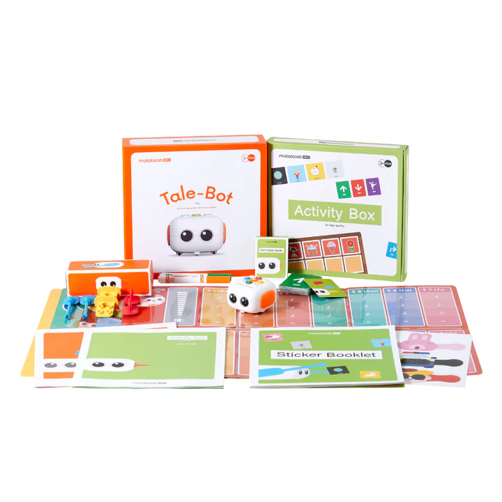
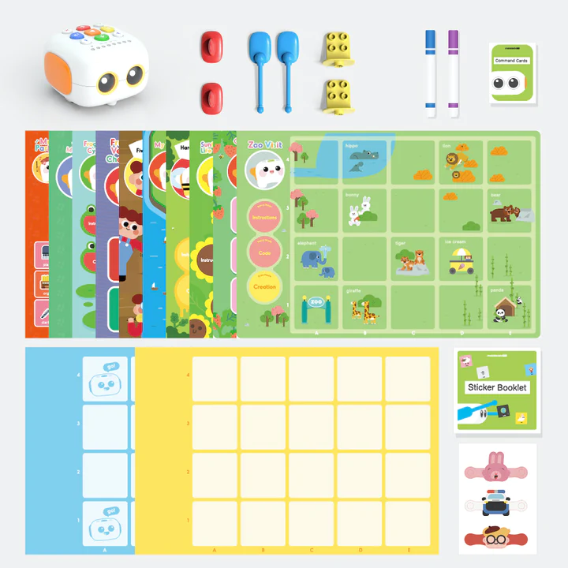
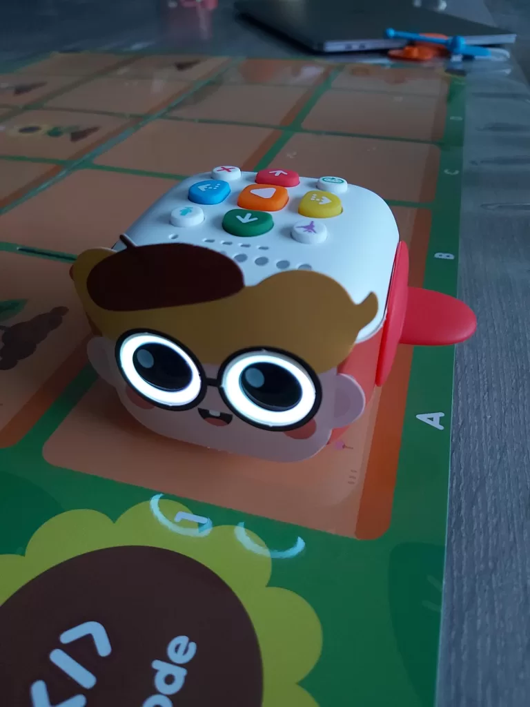
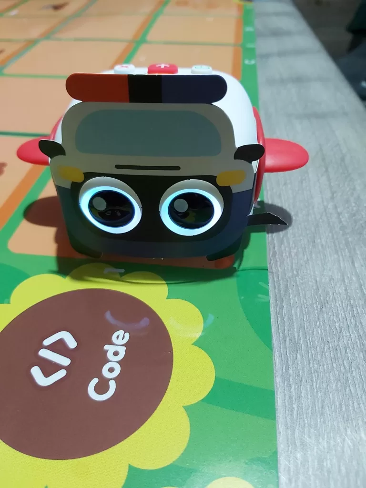

Le **Tale-Bot Pro** de Matatalab est un robot éducatif conçu pour aider les enfants à découvrir la logique, le langage et les premiers réflexes de programmation, sans écran.  
Dans cet article, je partage un retour d’expérience concret après plusieurs sessions à la maison avec un enfant de 4 ans.

> Cet article contient des liens affiliés Amazon. En tant que Partenaire Amazon, je peux percevoir une commission sur les achats éligibles, sans coût supplémentaire pour vous.

## Ce que vous allez découvrir dans ce test

- Ce qu’il y a dans la boîte (les éléments utiles dès le départ)
- Comment les activités se vivent en pratique à 3-6 ans
- Les points forts et les limites constatés
- Où acheter le Tale-Bot Pro (liens affiliés)

## Déballage du Tale-Bot Pro : ce que contient la boîte

Le coffret est pensé pour une prise en main immédiate. On retrouve notamment :

- le robot Tale-Bot Pro et son câble d’alimentation ;
- plusieurs accessoires (bras, ailes, supports compatibles) ;
- des déguisements pour personnaliser le robot ;
- des supports d’activités et une grille de configuration ;
- la documentation de démarrage.

Premier bon point : les commandes de base sont rapidement comprises (avancer, reculer, tourner).

## Premiers pas avec un enfant : retours terrain

### Activité histoire

Le mode histoire est l’un des points forts. Les contenus audio captent l’attention et aident l’enfant à rester concentré.  
Sur notre test, ce mode a été relancé plusieurs fois dans la même journée, signe d’un intérêt réel.

### Activités de comptage et de formes

Les activités de dénombrement et de repérage visuel sont adaptées au rythme des enfants.  
Elles stimulent la logique sans complexité inutile, ce qui permet une progression naturelle.

### Activité déguisement

La personnalisation du robot plaît beaucoup aux enfants.  
Dans notre cas, le changement de costumes a été un vrai moteur de motivation, et l’enfant a pu le faire avec autonomie.

Point de vigilance : certains éléments semblent plus fragiles si les manipulations sont très fréquentes.

## Avantages et limites du Tale-Bot Pro

### Les points que j’ai aimés

- Prise en main intuitive pour les 3 ans et +
- De nombreuses activités éducatives
- Un bon équilibre entre jeu libre et apprentissage guidé
- Une voix claire et des interactions motivantes

### Les limites constatées

- Déguisements/accessoires potentiellement fragiles
- Selon les périodes, certaines fonctions peuvent dépendre des disponibilités (documentation, plateformes, etc.)

## Où acheter le Tale-Bot Pro ? (liens affiliés)

Voici des liens pour comparer les prix et la disponibilité :

- <a href="https://www.amazon.fr/s?k=Matatalab+Tale-Bot+Pro&tag=manuso06-21" target="_blank" rel="noopener sponsored">Voir le Tale-Bot Pro sur Amazon</a>
- <a href="https://www.amazon.fr/s?k=robot+educatif+enfant&tag=manuso06-21" target="_blank" rel="noopener sponsored">Comparer d’autres robots éducatifs sur Amazon</a>

Vous pouvez aussi retrouver le Tale-Bot Pro directement chez Matatalab :  
[Tale-Bot Pro (boutique Matatalab)](https://shop.matatalab.com/collections/matatalab-coding-kits/products/matatalab-tale-bot-pro)

## FAQ (questions fréquentes)

### Pour quel âge est-il conseillé ?

Le Tale-Bot Pro est particulièrement adapté à la tranche 3 à 6 ans, avec des activités progressives pour garder l’enfant engagé.

### Est-ce que le robot parle en français ?

Lors de notre prise en main, la mise en français a été possible via la documentation et les réglages du robot.

### L’application est-elle nécessaire ?

Pour démarrer, l’essentiel passe par les supports d’activités et les commandes du robot.  
Selon les fonctions, une appli peut exister, mais ce n’est pas le point central pour débuter.

### Quelles sont les choses à surveiller ?

Si l’enfant change souvent de déguisements, il peut être utile de manipuler les accessoires avec douceur pour prolonger leur durée de vie.

## Conclusion

Après plusieurs jours de test, le **Tale-Bot Pro** a été adopté sans hésitation.  
C’est un excellent point de départ pour apprendre la robotique éducative tôt : on combine plaisir, autonomie et apprentissages fondamentaux, le tout dans un format ludique et accessible.

