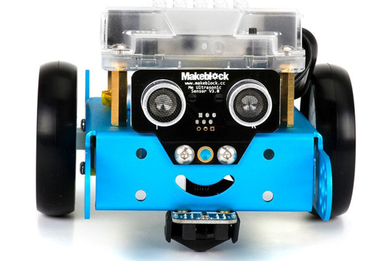
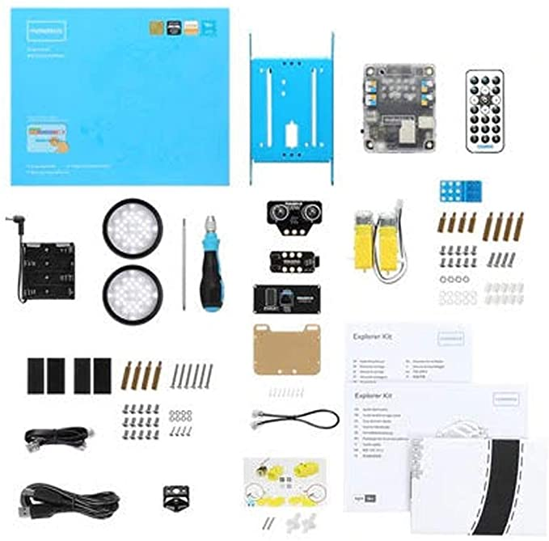

Le **mBot** de Makeblock est un excellent choix pour une première découverte de la robotique éducative.  
Il combine montage en kit, électronique de base et programmation visuelle, ce qui en fait une porte d’entrée idéale pour les débutants.

> Cet article contient des liens affiliés Amazon. En tant que Partenaire Amazon, je peux percevoir une commission sur les achats éligibles, sans coût supplémentaire pour vous.

## Pourquoi le mBot reste une valeur sûre pour débuter

Le mBot est souvent recommandé pour un premier achat, car il réunit des qualités clés :

- **facile à prendre en main** ;
- **progressif** (montage, découverte, puis programmation) ;
- **polyvalent** pour des activités à la maison ou en club ;
- **abordable** par rapport à d’autres robots éducatifs.

Il s’adresse autant aux jeunes à partir d’environ 10 ans (avec accompagnement au départ) qu’aux adultes qui veulent se lancer en robotique.

## 1) Assemblage du mBot

Le robot est livré en kit dans une boîte bien pensée. L’assemblage est une étape pédagogique à part entière : on comprend déjà la logique mécanique et la place des composants.

### Pourquoi le faire avec un adulte ?

Un accompagnement adulte est utile pour :

- sécuriser l’utilisation des outils ;
- éviter les erreurs de montage ;
- expliquer les étapes techniques ;
- encourager la persévérance quand une étape bloque.

### Les consommables à prévoir

Pour une utilisation confortable, prévois :

- des piles (idéalement rechargeables) ;
- selon ton matériel, une batterie compatible ;
- les piles pour les accessoires de télécommande si besoin.

## 2) Première utilisation du robot

Une fois monté, le mBot permet de tester rapidement des comportements simples :

- éviter les obstacles ;
- suivre une ligne noire ;
- pilotage manuel.

C’est parfait pour créer un effet “waouh” immédiat et motiver la suite : la programmation.

## 3) Programmation du mBot (mBlock / Scratch)

Avant de brancher le robot sur l’ordinateur, installe la bonne version de l’application : voir [Comment installer mBlock 5](/comment-installer-mblock-5/) (Windows, macOS, navigateur avec mLink, mobile).

Le vrai potentiel du mBot commence ici.  
La programmation visuelle sous **mBlock** (basé sur Scratch) rend l’apprentissage très accessible :

- blocs de commandes ;
- conditions ;
- boucles ;
- séquences logiques.

Avec quelques projets, on passe vite de “je teste un bloc” à “je construis un vrai comportement robot”.

## Où acheter le mBot ? (liens affiliés)

- <a href="https://www.amazon.fr/s?k=Makeblock+mBot&tag=manuso06-21" target="_blank" rel="noopener sponsored">Voir le mBot sur Amazon</a>
- <a href="https://www.amazon.fr/s?k=robot+educatif+programmation+enfant&tag=manuso06-21" target="_blank" rel="noopener sponsored">Comparer d’autres robots éducatifs</a>

## Conclusion

Le **mBot** est un excellent premier robot éducatif : il est concret, progressif et motivant.  
Si tu veux apprendre la robotique et la programmation en mode pratique, c’est un point de départ très solide.

