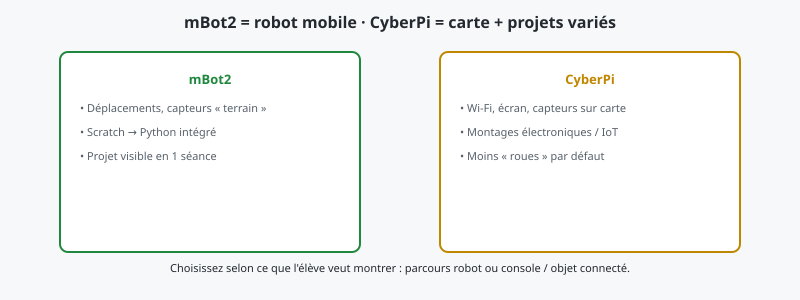

**mBot2** est avant tout un **robot mobile** : on pense **parcours**, **capteurs au sol**, **démo** en quelques minutes. **CyberPi** est une **carte de développement** : on pense **console**, **objets connectés**, **projet sans roues** si on le souhaite. Les deux sont Makeblock et **mBlock**, mais le **geste pédagogique** n’est pas le même.

## Prix indicatifs (France, mars 2026)

À titre indicatif au **29 mars 2026**, sur des offres courantes en ligne (Amazon et autres vendeurs) : le **mBot2** se situe souvent **autour de 167,95 €** ; la **CyberPi** (carte seule ou selon le pack) **autour de 59,99 €**. Les montants **varient** selon les promotions, la TVA affichée, le vendeur et les accessoires inclus — vérifiez toujours le **prix au moment de l’achat**.

## 1. Ce que le mBot2 fait particulièrement bien

- **Visible tout de suite** : le robot se déplace, évite, suit — idéal pour **motiver** un groupe ou une famille.
- **Scratch puis Python** dans une continuité souvent bien documentée pour la génération mBot2 — voir [l’article mBot2](/mbot2-de-makeblock-le-robot-educatif-pour-apprendre-la-robotique/).
- **Storytelling** : « notre robot a réussi le parcours » est un objectif **filmable** et **compris** par les non-initiés.

## 2. Ce que la CyberPi fait particulièrement bien

- **Projets sans nécessiter un terrain** : interface, mini-jeux, capteurs, **Wi-Fi** — voir [CyberPi](/decouvrez-makeblock-cyberpi-une-carte-de-developpement-electronique-polyvalente/).
- **Orientation « maker »** : l’ado veut **bricoler** au-delà du simple « robot qui roule ».
- **Pont** vers des montages **Makeblock** ou des idées plus **proches de l’électronique** que du seul jeu.

## 3. Les deux dans la même année scolaire ?

Certaines structures enchaînent : **CyberPi** sur table pour la logique et les capteurs « abstraits », **mBot2** pour la mise en scène **mobile**. À la maison, le budget décide souvent : commencez par le **besoin principal** — **rouler et défier** (mBot2) ou **expérimenter** sur carte (CyberPi).

## 4. Lien avec Raspberry Pi

Si l’ado veut surtout **Linux**, **serveur**, **Python hors robot**, lisez [Raspberry Pi ou kit robot](/raspberry-pi-ou-kit-robot-ado-guide/) : la CyberPi et le **Pi** ne jouent pas le même rôle, même si les mots « carte » et « Python » se croisent.

## Liens Amazon (affiliation)

- [mBot2 Makeblock](https://www.amazon.fr/s?k=mBot2+Makeblock&tag=manuso06-21)
- [CyberPi Makeblock](https://www.amazon.fr/s?k=CyberPi+Makeblock&tag=manuso06-21)
- [Kit électronique programmable enfant](https://www.amazon.fr/s?k=kit+%C3%A9lectronique+programmable+ado&tag=manuso06-21)

*Partenaire Amazon — commission possible sur achats éligibles.*

---

**En résumé** : **mBot2** pour la **robotique mobile** et les défis « sur le terrain » ; **CyberPi** pour la **carte** et des **projets ouverts**. Si vous hésitez encore, demandez à l’élève : il veut montrer **quoi** en premier — une **vidéo de robot** ou un **objet / interface** sur l’écran ?
