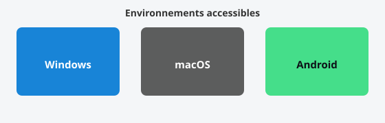

Bien choisir ton **environnement** dès le début évite la frustration : interpréteur à jour, éditeur lisible, et sur mobile une appli qui gère vraiment Python 3.



## 1. Ce dont tu as besoin

- **Python 3** (langage + commande `python` ou `py` dans le terminal).
- Un **éditeur de texte** ou **IDE** pour écrire des fichiers `.py` avec coloration syntaxique et exécution simple.
- (Optionnel) Un **terminal** ou une **console** intégrée pour lancer `python mon_script.py`.

## 2. Windows — installation gratuite et accessible

1. Télécharge l’installateur officiel sur **[python.org/downloads/windows](https://www.python.org/downloads/windows/)** (gratuit).
2. Lance l’installateur et **coche « Add python.exe to PATH »** avant d’installer — indispensable pour utiliser `python` dans l’invite de commandes ou PowerShell.
3. Vérifie dans un terminal :

```text
py --version
```

ou

```text
python --version
```

### Éditeur recommandé : Visual Studio Code (gratuit)

**[Visual Studio Code](https://code.visualstudio.com/)** est gratuit, accessible, très utilisé en formation. Après installation :

- Installe l’extension **Python** (Microsoft) depuis la barre d’extensions.
- Ouvre un dossier, crée un fichier `hello.py`, écris `print("OK")` et lance avec le bouton ▶ ou le terminal intégré.

### Alternative très pédagogique : Thonny

**[Thonny](https://thonny.org/)** est pensé pour l’enseignement : interface simple, pas de configuration lourde, débogueur intégré. Idéal si tu préfères un outil **tout-en-un** sans multiplier les fenêtres.

## 3. macOS

- Installe Python 3 depuis **[python.org/downloads/macos](https://www.python.org/downloads/macos/)** ou via **Homebrew** (`brew install python`) si tu es à l’aise avec le terminal.
- **VS Code** et **Thonny** existent aussi sur Mac (mêmes liens que ci-dessus).
- Vérifie la version : `python3 --version` (sur Mac, la commande s’appelle souvent `python3`).

## 4. Android — coder sur tablette ou téléphone

Les environnements PC restent le plus confortables pour de gros projets, mais tu peux **t’entraîner** sur Android :

- **[Pydroid 3](https://play.google.com/store/apps/details?id=ru.iiec.pydroid3)** — éditeur + interpréteur Python 3, pip pour des bibliothèques courantes, interface adaptée au tactile (gratuit avec pub ; version payante sans pub). C’est l’une des options les plus **stables** pour du Python 3 sur mobile.
- **Termux** (+ paquet `python`) convient aux utilisateurs à l’aise avec la ligne de commande — plus technique.

> Sur Android, privilégie des **petits scripts** et des exercices courts ; pour la série d’articles suivante, un PC facilitera copier-coller et fichiers.

## 5. Premier test commun à toutes les plateformes

Crée un fichier `hello.py` :

```python
print("Robot éducatif — Python OK")
```

Exécute-le avec ton éditeur ou en ligne de commande :

```text
python hello.py
```

ou `python3 hello.py` sur Mac.


## Exercices pratiques

1. Affiche ta version de Python dans le terminal (`--version`).
2. Crée `exo1.py` qui affiche trois lignes : ton prénom, ton âge (nombre), et une phrase au choix.
3. Dans VS Code ou Thonny, configure le thème clair ou sombre pour un confort de lecture.

## Ressources sur Amazon (partenaire)

Ces liens sont des **recherches** sur Amazon.fr ; vérifie fiche, avis et prix au moment de l’achat.

- [Livres « apprendre Python 3 »](https://www.amazon.fr/s?k=apprendre+python+3+livre&tag=manuso06-21)
- [Python pour débutants / enfants](https://www.amazon.fr/s?k=python+d%C3%A9butant+enfant+livre&tag=manuso06-21)
- [Programmation et algorithmique (grand public)](https://www.amazon.fr/s?k=programmation+algorithmique+livre+d%C3%A9butant&tag=manuso06-21)

## Suite du parcours

Passe à la leçon 2 : **variables et affichage** — lien dans l’encadré « articles liés » de la colonne ou ci-dessus.
