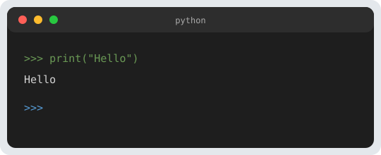

Ce mini-projet **recapitule** le parcours : saisie avec **`input`**, conversion **`int`**, boucle **`while`**, comparaisons **`if` / `elif` / `else`**, module **`random`**, et gestion d’une saisie incorrecte avec **`try` / `except`** ([leçon 9](/python-erreurs-debogage/)). Tu peux le coder dans le même dossier que tes autres scripts et le lancer avec `python plus_ou_moins.py`.



## 1. Règles du jeu

- L’ordinateur choisit un **nombre secret** entre **1** et **100** (inclus).
- Le joueur propose des **entiers** ; après chaque essai, le programme répond **trop petit**, **trop grand** ou confirme la victoire.
- À la fin, affiche **combien d’essais** ont été nécessaires.

## 2. Étapes de conception (avant de tout coder d’un bloc)

1. Tirer le secret avec **`random.randint(1, 100)`**.
2. Initialiser un compteur **`essais = 0`**.
3. Boucle : lire une proposition, **incrémenter** le compteur, comparer au secret, **`break`** quand c’est gagné.
4. Si la saisie n’est pas un entier, **ne pas** compter un essai ou compter selon ta règle — mais surtout **ne pas planter** : `except ValueError` + message + `continue`.

## 3. Solution de référence

```python
import random

secret = random.randint(1, 100)
essais = 0

while True:
    try:
        proposition = int(input("Ton nombre (1-100) ? "))
    except ValueError:
        print("Entre un entier.")
        continue

    essais += 1
    if proposition < secret:
        print("Trop petit.")
    elif proposition > secret:
        print("Trop grand.")
    else:
        print(f"Gagné en {essais} coup(s) !")
        break
```

Tu peux ajouter un test : si la proposition est **hors** de 1–100, afficher un avertissement sans augmenter `essais` (petit exercice de logique).

## 4. Tests rapides à faire à la main

- Gagner en **un** coup (chance) : le compteur doit afficher **1**.
- Taper **`abc`** : message « Entre un entier », boucle **sans** crash.
- Enchaîner **trop petit** puis **trop grand** : le programme doit toujours guider jusqu’au bon nombre.

## Exercices pour aller plus loin

1. **Limite d’essais** (ex. **7**) : à épuisement, affiche le **secret** et « perdu ».
2. **Deux niveaux** au départ : plage **1–50** ou **1–200** (`input` pour le choix, puis `randint` adapté).
3. Enregistrer le **meilleur score** (moins d’essais) dans **`record.txt`** — voir [leçon 8](/python-fichiers-texte/) : lecture du record actuel, comparaison, réécriture si battu.
4. Affiche un **indice** tous les 5 essais (par exemple : « le secret est pair » ou borne restreinte — à toi de définir une règle équitable).
5. **Rejouer** : à la fin, demande `Encore une partie ? (o/n)` et relance une nouvelle partie si l’utilisateur répond oui.

## Après ce parcours

Tu disposes d’une **base solide** pour des projets perso (petits outils, jeux texte, automatisation légère). N’hésite pas à revenir sur [/programmation/python](/programmation/python) pour enchaîner les leçons ou les réviser dans l’ordre.

## Amazon (partenaire)

- [Projets Python jeux et applications](https://www.amazon.fr/s?k=python+projets+jeux+livre&tag=manuso06-21)
- [Python 3 coffret ou manuel complet](https://www.amazon.fr/s?k=python+3+coffret+apprendre&tag=manuso06-21)
